# Quick Send - Class Diagram

This diagram shows the relationship between Auth, Home, Send Money, and Transaction features following Clean Architecture and BLoC pattern.

```mermaid
classDiagram
    %% Core Services
    class CachedService {
        <<interface>>
        +cacheUserData(UserModelDto userData)
        +getCacheUserData() UserModelDto
        +cacheToken(String token)
        +clearCacheToken()
        +getToken() String
    }

    class CachedServiceImpl {
        -FlutterSecureStorage securePref
        +cacheUserData(UserModelDto userData)
        +getCacheUserData() UserModelDto
        +cacheToken(String token)
        +clearCacheToken()
        +getToken() String
    }

    %% Core Models
    class UserModelDto {
        +String id
        +String name
        +String phoneNumber
        +toJson() Map~String, dynamic~
        +fromJson(Map~String, dynamic~) UserModelDto
        +toEntity() UserEntity
        +fromEntity(UserEntity) UserModelDto
    }

    class UserEntity {
        +String id
        +String name
        +String phoneNumber
    }

    %% Auth Feature
    class AuthState {
        +bool isLoading
        +bool isFinished
        +bool hasSession
        +bool hidePassword
        +bool hideConfirmPassword
        +bool showSignup
        +String errorText
        +String successText
    }

    class AuthBloc {
        -AuthRepository repo
        +initialized()
        +togglePasswordVisibility()
        +toggleConfirmPasswordVisibility()
        +onShowSignup(bool value)
        +login(String email, String password)
        +signup(String email, String password)
    }

    class AuthRepository {
        <<interface>>
        +login(String email, String password) Either~Failure, Map~String, dynamic~~
        +signup(String email, String password) Either~Failure, Map~String, dynamic~~
        +hasSession() bool
    }

    class AuthModelDto {
        +String id
        +String accessToken
        +UserModelDto user
        +toJson() Map~String, dynamic~
        +fromJson(Map~String, dynamic~) AuthModelDto
    }

    %% Home Feature
    class HomeState {
        +bool isLoading
        +bool isFinished
        +bool hideAmount
        +String errorText
        +String successText
    }

    class HomeBloc {
        -CachedService cache
        +initialized()
        +logout()
        +toggleHideAmount()
    }

    %% Send Money Feature
    class SendMoneyState {
        +bool isLoading
        +bool isFinished
        +String errorText
        +String successText
    }

    class SendMoneyBloc {
        -TransactionRepository txn
        -CachedService cache
        +initialized()
        +sendMoney(String amount)
    }

    %% Transaction Feature
    class TransactionState {
        +bool isLoading
        +bool isFinished
        +List~TransactionModelDto~ transactions
        +String errorText
        +String successText
    }

    class TransactionBloc {
        -TransactionRepository txn
        -CachedService cache
        +initialized()
        +getTransactions()
    }

    class TransactionRepository {
        <<interface>>
        +sendPayment(String senderId, double amount)
        +getAllTransactions(String senderId) Either~Failure, List~TransactionModelDto~~
    }

    class TransactionModelDto {
        +String id
        +UserModelDto sender
        +String senderId
        +UserModelDto receiver
        +double amount
        +String date
        +toJson() Map~String, dynamic~
        +fromJson(Map~String, dynamic~) TransactionModelDto
    }

    %% Relationships
    CachedServiceImpl ..|> CachedService : implements
    UserModelDto --> UserEntity : converts to/from

    %% Auth Feature Relationships
    AuthBloc --> AuthState : emits
    AuthBloc --> AuthRepository : uses
    AuthModelDto --> UserModelDto : contains

    %% Home Feature Relationships
    HomeBloc --> HomeState : emits
    HomeBloc --> CachedService : uses

    %% Send Money Feature Relationships
    SendMoneyBloc --> SendMoneyState : emits
    SendMoneyBloc --> TransactionRepository : uses
    SendMoneyBloc --> CachedService : uses

    %% Transaction Feature Relationships
    TransactionBloc --> TransactionState : emits
    TransactionBloc --> TransactionRepository : uses
    TransactionBloc --> CachedService : uses
    TransactionState --> TransactionModelDto : contains list
    TransactionModelDto --> UserModelDto : contains sender/receiver

    %% Cross-Feature Dependencies
    %% Note: These represent logical flow relationships, not direct code dependencies
    
    %% Shared Dependencies
    AuthBloc --> CachedService : session management
    SendMoneyBloc --> UserModelDto : user validation
    TransactionBloc --> UserModelDto : user identification

    %% BLoC Pattern
    class Cubit~T~ {
        <<abstract>>
        +emit(T state)
    }

    AuthBloc --|> Cubit : extends Cubit~AuthState~
    HomeBloc --|> Cubit : extends Cubit~HomeState~
    SendMoneyBloc --|> Cubit : extends Cubit~SendMoneyState~
    TransactionBloc --|> Cubit : extends Cubit~TransactionState~
```

## Architecture Overview

### Feature Flow

1. **Auth → Home**: After successful authentication, user navigates to home screen
2. **Home → Send Money**: User initiates money transfer from home screen
3. **Send Money → Transaction**: Money transfer creates transaction records
4. **Transaction → Send Money**: Transaction history provides feedback for future transfers

**Note**: The class diagram above shows structural relationships between classes. For behavioral flow between features, refer to the sequence diagrams which better illustrate the temporal interactions and user journeys.

### Key Design Patterns

#### BLoC Pattern

- Each feature implements BLoC (Business Logic Component) pattern
- Cubits manage state and emit new states based on events
- States are immutable using Freezed code generation

#### Repository Pattern

- Abstract repositories define contracts for data operations
- Concrete implementations handle API calls and data transformation
- Either type from Dartz library handles success/failure scenarios

#### Dependency Injection

- GetIt service locator provides dependencies
- CachedService manages persistent storage across features
- Shared services enable cross-feature communication

#### Clean Architecture Layers

- **Presentation**: BLoCs, States, and UI components
- **Domain**: Entities and Repository interfaces
- **Data**: Models, Repository implementations, and Data sources

### Shared Components

- **UserModelDto/UserEntity**: Core user data structure used across all features
- **CachedService**: Persistent storage for user sessions and data
- **TransactionRepository**: Shared between SendMoney and Transaction features
- **Failure/Either**: Error handling pattern from Dartz library
