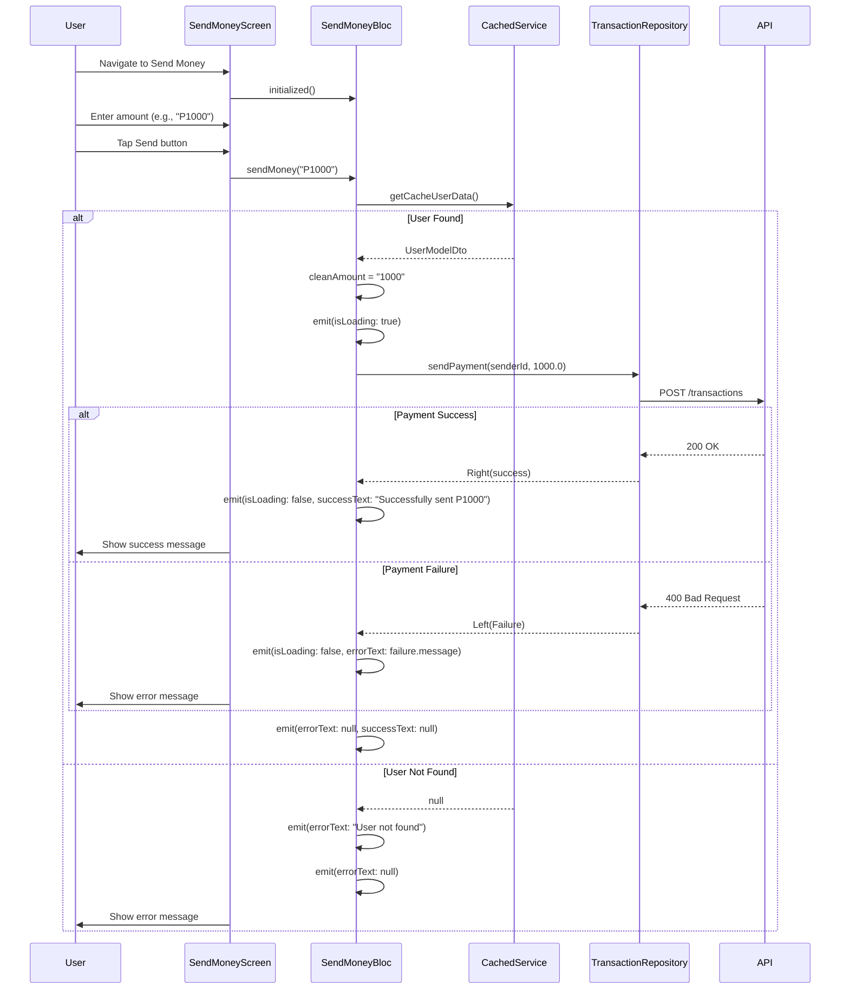

# Quick Send - Sequence Diagrams

This document shows the sequence of interactions between users, UI components, BLoCs, repositories, and services for the main user flows in the Quick Send application.

## 1. Authentication Flow

### Login Sequence

### Signup Sequence

### Session Check Sequence

## 2. Home Screen Flow

### Home Screen Initialization

### Logout Sequence

### Toggle Amount Visibility

## 3. Send Money Flow

### Send Money Transaction

## 4. Transaction History Flow

### Load Transaction History

## 5. Complete User Journey

### End-to-End Flow: Login → Send Money → View Transactions

## Error Handling Patterns

### Common Error Scenarios

## State Management Pattern

### BLoC State Emission Pattern

